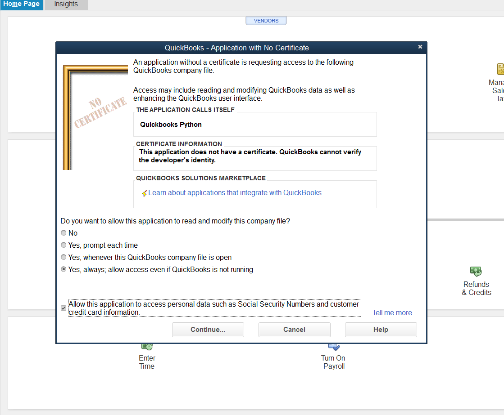
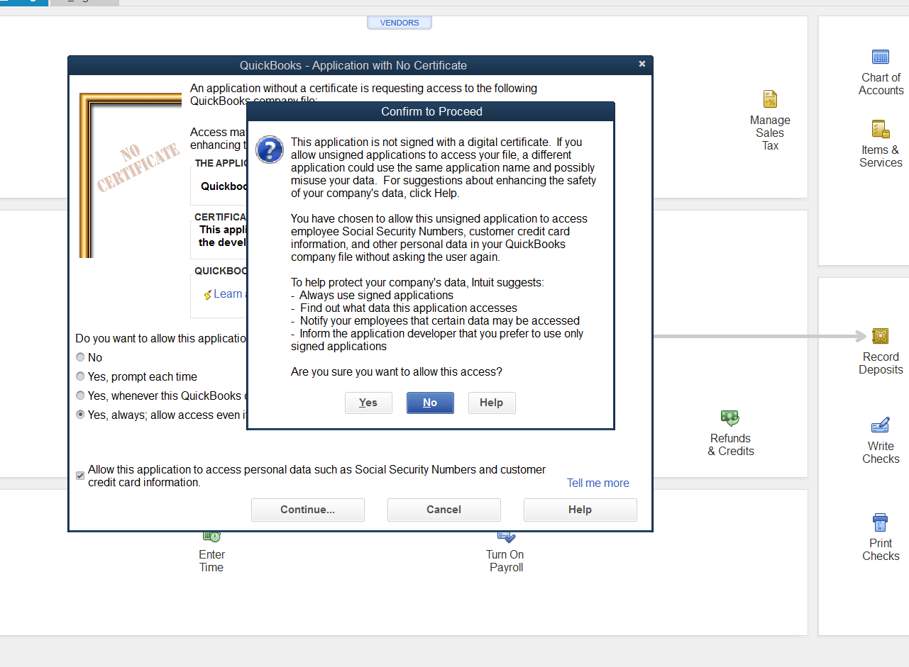
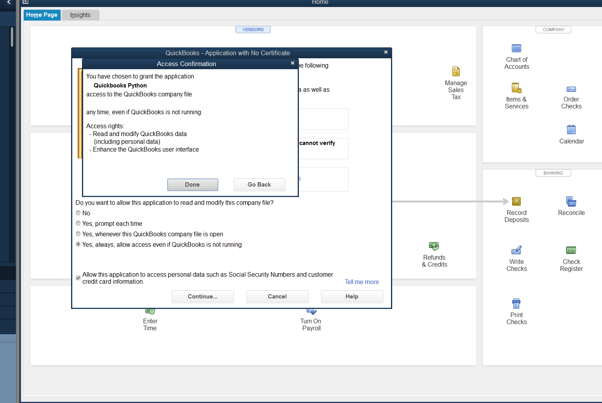
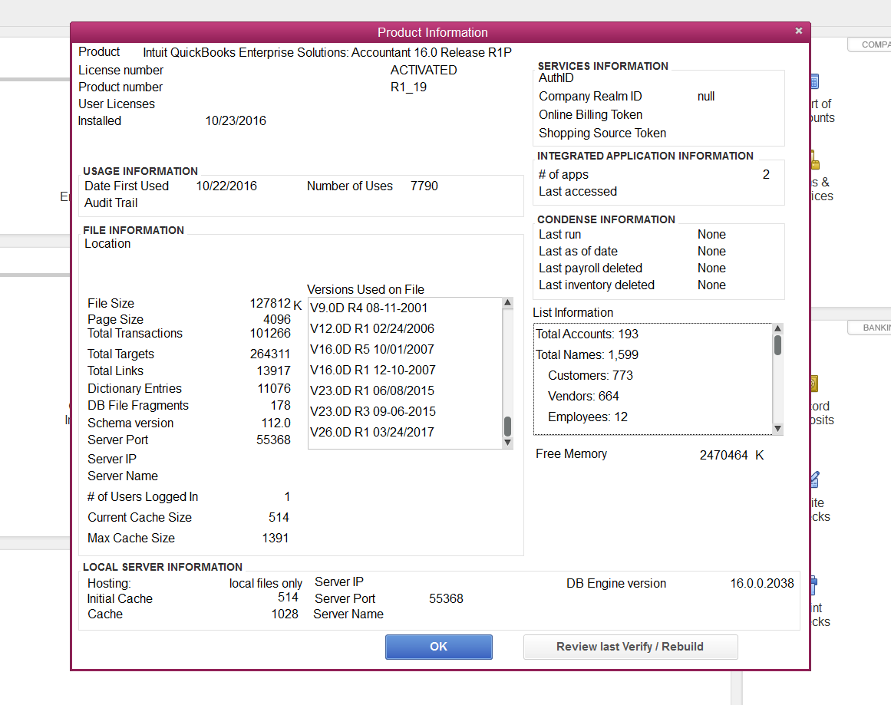

Quickbooks Desktop  Python wrapper
==================================

This supports all transaction type!

###Requirements:

- Windows (32 bit recommended) if you want to work without the qwc
- win32com IMPORTANT ! if you want to work directly without qwc `pip install pypiwin32`
- Quickbooks > Pro Version, Enterprise edition
- Administrator account
- Python (32BIT not 64BIT)
- xmltodict


To installl :
- `pip install quickbooks`

# You will need to do the following the first time you run :

### First time you run check to boxes
- Yes, Always, Allow access even if QuickBooksis not running
- Allow this application to personal data such as Social Security numbers and customer credit card information





install win32com

in your code write this:

```
from quickbooks import Quickbooks

Quickbooks(qb_file='path_to_your_file').get_all()


from quickbooks import Customer

# Retrieve all customer
Customer.retrieve()

# Retrieve customers based on filter
Customer.filter(date='2016-02-02')

# Add Customer
 Customer.create('name')
```


## RECIPES
Read every possible transaction from quickbooks
this script generates a erros.json and a success.json containing the log.

every transaction will have a separate file with the extension xml
`
def get_all_queries():
    from quickbooks.resource_list import resource_list
    from quickbooks import resource
    query_resources = []
    companies = [

    os.path.abspath(os.path.join("..", 'client files', 'qbfile', 'name-of-the-qb.qbw')),
    ]

    for company in companies:
        for entry in resource_list:
            if hasattr(resource, entry):
                if 'query' in  getattr(resource, entry).methods:
                    query_resources.append(entry)

        company_name = company.split('/')[-1]

        for q in query_resources:
            print("Now pulling out: {}".format(q))
            base_dir = os.path.join("..", 'data')
            file_dir_name = company.split('\\')[-1].split('.')[0]
            if not os.path.exists(os.path.join(base_dir, file_dir_name)):
                os.makedirs(os.path.join(base_dir, file_dir_name))

            filename = os.path.join(base_dir, file_dir_name, '{}.xml'.format(q))
            try:
                with open(filename, 'w+') as f:
                    f.write(getattr(resource, q)(quickbooks_file_location=company).retrieve())
            except Exception as e:
                if 'Could not start QuickBooks' in e:
                    sleep(10)
                print("error with: {}".format(q))
                with open(os.path.join(base_dir, file_dir_name, 'error_{}.txt'.format(q)), 'w+') as f:
                    f.write("======{}======".format(q))
                    f.write(str(e))
            print("finished with {}".format(q))


        qb = Quickbooks(qb_file=company)`


### Merge two company
I would recommended to merge the smaller into the bigger one.
Things to do before :
- Make backup
- Make a report of your chart of account
- Count the number of targets (F2 key)
- 

Activate the debug option below, the script will try to retrieve any error in the log file.

Tested transaction (merge) will write and skip duplicated (continue on error):
-
-
####Problems and tips when dealing with win32com
to debug quickbooks go to c:\programData\intuit\quickbooks\QBSDK.ItemNonInventory
add this :
`[Log]
Level=verbose
UnlimitedSize=Y
[Parser]
DumpRequestData=Y
SdkAccelerator=N`

If your using the win32com make sure you have the 32bit version of the package
if you get a something like could not start quickbooks with an error  -2147220472
make sure the quickbooks company file path is correct.

BoolType is 1 for true, 0 for false or lowercase str true or false


Explanation about all this files :
Use script.py and final.py
script4 and final are supposed to be the same thing , use final.py
need to refactor this files and remove unused ones.
that are the correct files.

script will


